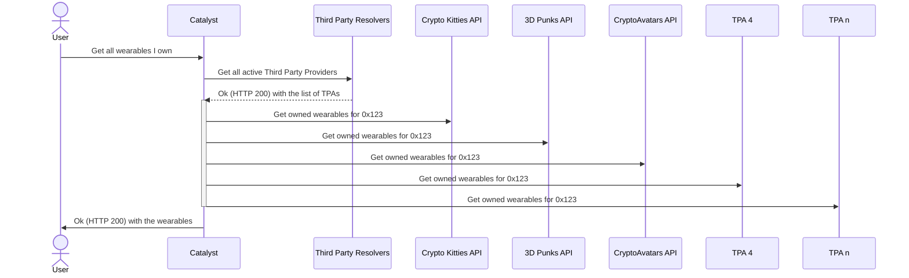
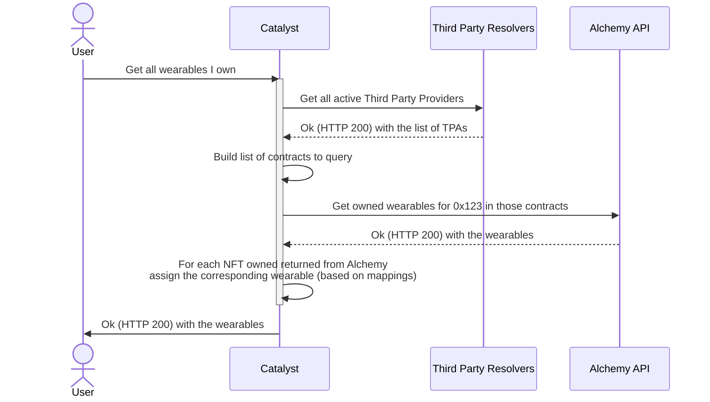

# template-server

## Architecture

Extension of "ports and adapters architecture", also known as "hexagonal architecture".

With this architecture, code is organized into several layers: logic, controllers, adapters, and ports.

## Application lifecycle

1. **Start application lifecycle** - Handled by [src/index.ts](src/index.ts) in only one line of code: `Lifecycle.run({ main, initComponents })`
2. **Create components** - Handled by [src/components.ts](src/components.ts) in the function `initComponents`
3. **Wire application & start components** - Handled by [src/service.ts](src/service.ts) in the funciton `main`.
   1. First wire HTTP routes and other events with [controllers](#src/controllers)
   2. Then call to `startComponents()` to initialize the components (i.e. http-listener)

The same lifecycle is also valid for tests: [test/components.ts](test/components.ts)

## Namespaces

### src/logic

Deals with pure business logic and shouldn't have side-effects or throw exceptions.

### src/controllers

The "glue" between all the other layers, orchestrating calls between pure business logic, adapters, and ports.

Controllers always receive an hydrated context containing components and parameters to call the business logic e.g:

```ts
// handler for /ping
export async function pingHandler(context: {
  url: URL // parameter added by http-server
  components: AppComponents // components of the app, part of the global context
}) {
  components.metrics.increment("test_ping_counter")
  return { status: 200 }
}
```

### src/adapters

The layer that converts external data representations into internal ones, and vice-versa. Acts as buffer to protect the service from changes in the outside world; when a data representation changes, you only need to change how the adapters deal with it.

### src/ports

The layer that communicates with the outside world, such as http, kafka, and the database.

### src/components.ts

We use the components abstraction to organize our ports (e.g. HTTP client, database client, redis client) and any other logic that needs to track mutable state or encode dependencies between stateful components. For every environment (e.g. test, e2e, prod, staging...) we have a different version of our component systems, enabling us to easily inject mocks or different implementations for different contexts.

We make components available to incoming http and kafka handlers. For instance, the http-server handlers have access to things like the database or HTTP components, and pass them down to the controller level for general use.


### Diagram with problem


### Diagram with solution

